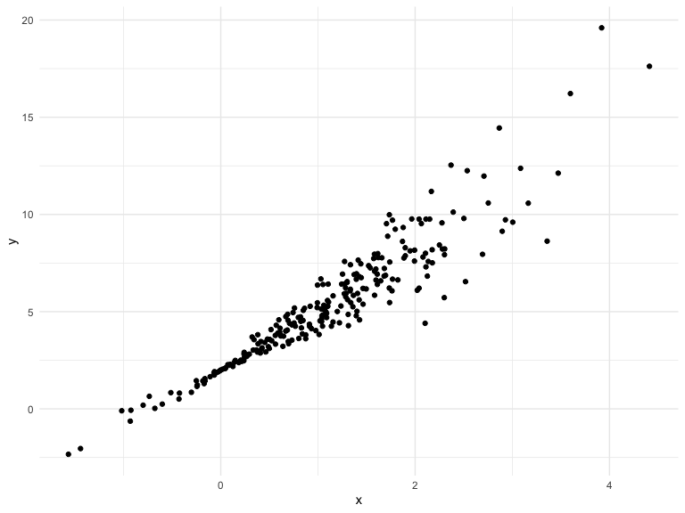
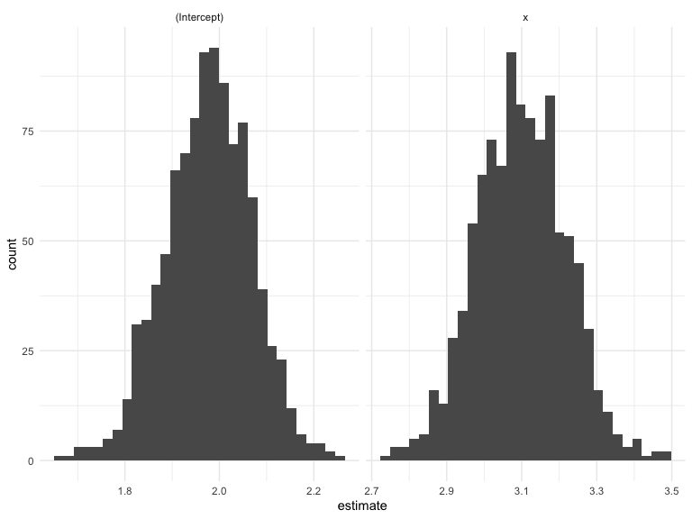
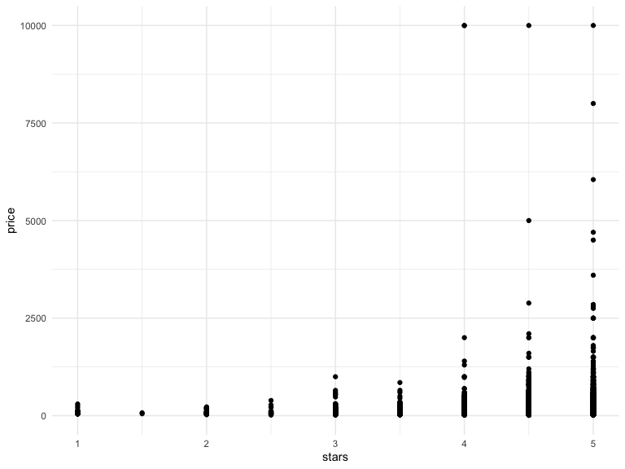
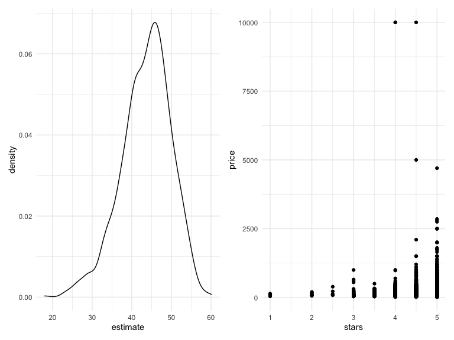

Bootstrapping
================
Wanxin Qi
11/17/2021

## Simulate a dataset

``` r
n_samp = 250

sim_df_const = 
  tibble(
    x = rnorm(n_samp, 1, 1),
    error = rnorm(n_samp, 0, 1),
    y = 2 + 3 * x + error
  )

sim_df_nonconst = sim_df_const %>% 
  mutate(
  error = error * .75 * x,
  y = 2 + 3 * x + error
)
```

Make a plot

``` r
sim_df_nonconst %>%
  ggplot(aes(x = x, y = y)) +
  geom_point()
```



``` r
sim_df_nonconst %>%
  lm(y ~ x, data = .) %>%
  broom::tidy()
```

    ## # A tibble: 2 × 5
    ##   term        estimate std.error statistic   p.value
    ##   <chr>          <dbl>     <dbl>     <dbl>     <dbl>
    ## 1 (Intercept)     1.98    0.104       19.0 2.02e- 50
    ## 2 x               3.09    0.0720      43.0 6.06e-117

## Let’s try to use the bootstrap for inference

``` r
bootstrap_sample = 
  sim_df_nonconst %>%
    sample_frac(size = 1, replace = TRUE) %>%
    arrange(x)

lm(y ~ x, data = bootstrap_sample)
```

    ## 
    ## Call:
    ## lm(formula = y ~ x, data = bootstrap_sample)
    ## 
    ## Coefficients:
    ## (Intercept)            x  
    ##       1.750        3.245

Let’s write a function …

``` r
boot_sample = function(df) {
  
  sample_frac(df, size = 1, replace = TRUE)
  
}
```

Now, we’ll make a tibble to keep track of everything.

``` r
boot_strap_df =
  tibble(
    strap_number = 1:1000,
    strap_sample = rerun(1000, boot_sample(sim_df_nonconst))
  )
```

From here … things are kinda the same as “always”

``` r
bootstrap_results = 
  boot_strap_df %>%
    mutate(
      models = map(.x = strap_sample, ~lm(y ~ x, data = .x)),
      results = map(models, broom::tidy)
    ) %>%
  select(strap_number, results) %>%
  unnest(results)

bootstrap_results %>%
  ggplot(aes(x = estimate)) +
  geom_histogram() +
  facet_grid(~term, scales = "free")
```

    ## `stat_bin()` using `bins = 30`. Pick better value with `binwidth`.



``` r
lm(y ~ x, data = sim_df_const) %>%
  broom::tidy()
```

    ## # A tibble: 2 × 5
    ##   term        estimate std.error statistic   p.value
    ##   <chr>          <dbl>     <dbl>     <dbl>     <dbl>
    ## 1 (Intercept)     1.87    0.0933      20.0 8.84e- 54
    ## 2 x               3.12    0.0646      48.3 3.34e-128

``` r
bootstrap_results %>%
  group_by(term) %>%
  summarize(
    se = sd(estimate)
  )
```

    ## # A tibble: 2 × 2
    ##   term            se
    ##   <chr>        <dbl>
    ## 1 (Intercept) 0.0916
    ## 2 x           0.119

## Use `modelr`

``` r
sim_df_nonconst %>%
  bootstrap(n = 1000, id = "strap_number") %>%
  mutate(
    models = map(.x = strap, ~lm(y ~ x, data = .x)),
    results = map(models, broom::tidy)
  )
```

    ## # A tibble: 1,000 × 4
    ##    strap                strap_number models results         
    ##    <list>               <chr>        <list> <list>          
    ##  1 <resample [250 x 3]> 0001         <lm>   <tibble [2 × 5]>
    ##  2 <resample [250 x 3]> 0002         <lm>   <tibble [2 × 5]>
    ##  3 <resample [250 x 3]> 0003         <lm>   <tibble [2 × 5]>
    ##  4 <resample [250 x 3]> 0004         <lm>   <tibble [2 × 5]>
    ##  5 <resample [250 x 3]> 0005         <lm>   <tibble [2 × 5]>
    ##  6 <resample [250 x 3]> 0006         <lm>   <tibble [2 × 5]>
    ##  7 <resample [250 x 3]> 0007         <lm>   <tibble [2 × 5]>
    ##  8 <resample [250 x 3]> 0008         <lm>   <tibble [2 × 5]>
    ##  9 <resample [250 x 3]> 0009         <lm>   <tibble [2 × 5]>
    ## 10 <resample [250 x 3]> 0010         <lm>   <tibble [2 × 5]>
    ## # … with 990 more rows

## Airbnb data

``` r
data("nyc_airbnb")

nyc_airbnb =
  nyc_airbnb %>%
  mutate(stars = review_scores_location / 2) %>%
  rename(
    borough = neighbourhood_group
  ) %>%
  filter(borough != "Staten Island") %>%
  select(price, stars, borough, room_type)
```

``` r
nyc_airbnb %>%
  ggplot(aes(x = stars, y = price)) +
  geom_point()
```



``` r
airbnb_boostrap_results =
  nyc_airbnb %>%
    filter(borough == "Manhattan") %>%
    bootstrap(n = 1000, id = "strap_number") %>%
    mutate( 
      models = map(.x = strap, ~lm(price ~ stars, data = .x)),
      results = map(models, broom::tidy)
    ) %>%
    select(strap_number, results) %>%
    unnest(results)

ggp_star_est =
  airbnb_boostrap_results %>%
    filter(term == "stars") %>%
    ggplot(aes(estimate)) +
    geom_density()

ggp_scatter =
  nyc_airbnb %>%
  filter(borough == "Manhattan") %>%
  ggplot(aes(x = stars, y = price)) +
  geom_point()

ggp_star_est + ggp_scatter
```


